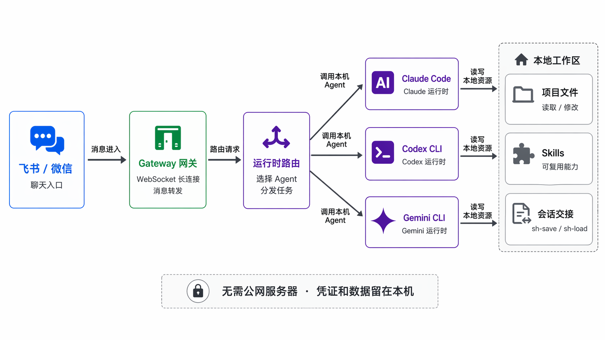

# Claude Feishu Gateway

把飞书 / 微信消息转发到你本机的 AI Coding Agent。

无需公网服务器。只要本机启动 `make gateway`，就可以在手机上调用 Claude Code、Codex CLI 或 Gemini CLI，让它们在你的电脑里读文件、执行命令、继续会话，并把结果回传到聊天窗口。



## 核心能力

- **多运行时**：支持 Claude、Codex、Gemini
- **多入口**：飞书 Bot，微信 listener 可选
- **会话管理**：`/sessions`、`/switch`、`/pin`
- **执行控制**：`/stop` 中断任务，运行状态实时回传
- **模型切换**：Claude / Codex 支持 `/model`
- **可恢复工作流**：`sh-save` 保存进度，`sh-load` 恢复上下文
- **本地优先**：凭证、登录态、handoff、运行数据都留在本机

## 它能解决什么问题

**1. 随时随地驱动本机 Agent**

手机打字或语音，消息经飞书或微信转给本机 Claude / Codex / Gemini 运行时。执行完成后，结果会回传到聊天窗口。不用开电脑，不用 SSH，不用记命令。

**2. 在多个 Agent 之间切换**

同一个 Gateway 可以按配置切换到 Claude、Codex 或 Gemini。你可以继续使用原来的 Claude Code，也可以把 Codex / Gemini 接入同一套飞书入口。

**3. 长任务可以保存和恢复**

通过 `sh-save` / `sh-load` 保存和恢复本地会话交接。长任务中断后，可以先保存当前目标、已完成内容、决策、风险和下一步；下次新会话直接恢复到可执行状态。

**4. 保留本地知识库和 Skill**

仓库内置 PARA 风格的知识组织方式和通用 Skill。`kb-evolve` 用于知识库进化与代码自省，`kb-distill` 用于把会话经验、调研结论和踩坑记录沉淀下来。

## 能力矩阵

| 能力 | Claude | Codex | Gemini | 微信 listener |
| --- | --- | --- | --- | --- |
| 飞书消息入口 | 是 | 是 | 是 | 可选旁路 |
| 会话续聊 | 是 | 是 | 是 | 走 Codex |
| `/sessions` 历史会话 | 是 | 是 | 是 | 不适用 |
| `/switch` 切换会话 | 是 | 是 | 是 | 不适用 |
| `/model` 模型切换 | 是 | 是 | 暂不支持 | 不适用 |
| `/stop` 中断任务 | 是 | 是 | 是 | 不适用 |

## 开源边界

这个仓库只保留通用 Gateway 能力：

- Claude / Codex / Gemini Gateway
- 飞书 Bot 长连接入口
- 可选微信 listener
- 会话、模型、停止等基础控制命令

## 包含什么

| 组件                     | 说明                                                                 |
| ------------------------ | -------------------------------------------------------------------- |
| **Gateway**        | Python Claude Gateway + Node Codex/Gemini Gateway |
| **Daemon**         | 类 cron 调度器，触发 Claude Code skill，支持自适应调度               |
| **CLAUDE.md**      | 知识库组织规则，Agent 行为准则                                       |
| **7 个通用 Skill** | kb-evolve, kb-distill, sh-save, sh-load, skill-creator, root-review, feishu-push |
| **feishu-push**    | 飞书 Webhook 推送工具（告警/日报/通用消息）                          |

## 快速开始

### 你需要准备

1. **一台普通电脑**（Windows / Mac / Linux）
2. **至少一种本机 Agent 登录态**
   - Claude：Claude Code，或兼容 Anthropic API 的第三方服务商
   - Codex：Codex CLI / Codex SDK 可用登录态
   - Gemini：Gemini CLI 登录态，或 `GEMINI_API_KEY`
3. **飞书自建应用**（免费，5 分钟创建）
4. **Node.js**
   - Codex / Gemini Gateway：Node.js `>=20`
   - 微信 listener：Node.js `>=22`

### 四步启动

```bash
# 1. 克隆仓库
git clone https://github.com/ketchupz1999/claude-feishu-gateway.git
cd claude-feishu-gateway

# 2. 安装依赖 + 配置飞书凭证
make init
cp .claude/secrets/feishu_app.example.json .claude/secrets/feishu_app.json
# 编辑 feishu_app.json，填入 app_id、app_secret、allowed_open_id

# 3. 选择 Gateway 运行时（默认 codex）
cp components/config.example.yaml components/config.yaml
# 编辑 components/config.yaml，把 gateway_mode 改成 claude / codex / gemini

# 4. 启动
make check      # 配置检查
make gateway    # 飞书网关
make daemon     # 后台守护（可选）
```

打开飞书，给你的 Bot 发一条消息，就开始干活了。

## Gateway 模式

### Codex 模式

默认模式，通过 `components/config.yaml` 启用：

```yaml
gateway_mode: codex
```

`make init` 会安装 Node Gateway 依赖。你也可以单独安装并测试：

```bash
make gateway-codex-install
make gateway-codex-build
make gateway-codex-test
make gateway
```

前置条件：

- 本机 Codex CLI / SDK 已可用。
- 不设置 `CODEX_API_KEY` 时，会复用本机 Codex 登录态。
- `CODEX_SANDBOX_MODE` 和 `CODEX_APPROVAL_POLICY` 可通过环境变量调整。

### Claude 模式

沿用原有 Python Gateway：

```yaml
gateway_mode: claude
```

```bash
make gateway
```

前置条件：

- 已安装并登录 Claude Code，或已配置 `config/env.conf` 里的 Anthropic 兼容 API。

### Gemini 模式

通过 `components/config.yaml` 启用：

```yaml
gateway_mode: gemini
```

启动方式同 Node Gateway：

```bash
make gateway-codex-install
make gateway-codex-build
make gateway-codex-test
make gateway
```

前置条件：

- 本机 `gemini` CLI 已登录，或配置了 `GEMINI_API_KEY`。
- Gateway 不会在后台进程里弹浏览器登录；未登录时会直接向飞书返回“Gemini 未登录”。
- Gemini 模式当前不支持飞书侧 `/model` 切换，请在 Gemini CLI 配置里调整默认模型。

### 微信 listener

微信通道是可选能力：

```bash
make weixin-doctor
make weixin-setup
make weixin-login
```

要求 Node.js `>=22`，登录态默认写在本地 `data/weixin_state/`，不会进入 git。

如需随 Gateway 一起启动，启用 `components/config.yaml`：

```yaml
listener_channels:
  weixin:
    enabled: true
```

## 发布前验收

发版或提 PR 前建议至少跑：

```bash
make check
make gateway-codex-build
make gateway-codex-test
make weixin-doctor
```

本机联调建议按阶段验证：

1. `gateway_mode: codex`，飞书发送 `hi`、`/sessions`、`/stop`。
2. `gateway_mode: gemini`，飞书发送 `hi`、`/sessions`、一个只读文件问题。
3. 如果启用微信，先执行 `make weixin-login`，再启动 listener。

### 详细部署文档

第一次用或不熟悉命令行？看分步指南：

**macOS**

- [通过第三方服务商部署](docs/setup/mac-thirdparty.md)（StepFun / DeepSeek，无需订阅）
- [通过 Claude Code 订阅部署](docs/setup/mac-claude.md)
- [环境准备：安装 Python / Claude Code](docs/setup/prerequisites-mac.md)

**Windows**

- [通过第三方服务商部署](docs/setup/windows-thirdparty.md)（StepFun / DeepSeek，无需订阅）
- [环境准备：安装 Git / Python / Claude Code](docs/setup/prerequisites-windows.md)

## 第三方 API 配置

不想付 Claude 订阅？用兼容 Anthropic API 的第三方服务商也能跑。创建 `config/env.conf`：

```ini
ANTHROPIC_BASE_URL=https://api.stepfun.com/anthropic
ANTHROPIC_API_KEY=你的api_key
ANTHROPIC_MODEL=step-3.5-flash
```

`make gateway` 会自动加载这个文件。详见 [第三方 API 部署文档](docs/setup/mac-thirdparty.md#第四步配置第三方-api)。

## 自带 Skill

每个 Skill 就是一个 `SKILL.md` 文件，自然语言描述，不需要学框架 API：

| Skill                | 说明                           |
| -------------------- | ------------------------------ |
| `kb-evolve`      | 知识库进化与代码自省，清理过时内容 |
| `kb-distill`     | 将会话经验、调研结论、踩坑记录沉淀为知识 |
| `sh-save`        | 保存当前任务的短期会话交接 |
| `sh-load`        | 从本地 handoff 恢复可执行工作简报 |
| `skill-creator`  | 让 agent 自己创建新 Skill      |
| `root-review`    | 根因分析，定位问题根源         |
| `feishu-push`    | 飞书 Webhook 推送              |

## 飞书聊天命令

| 命令             | 说明         |
| ---------------- | ------------ |
| `/model`       | 查看或切换模型（Claude / Codex 模式；Gemini 暂不支持） |
| `/clear`       | 清除当前会话 |
| `/new`         | 新建会话 |
| `/sessions`    | 查看会话列表 |
| `/switch 1`    | 按序号切换历史会话 |
| `/pin 1`       | 置顶历史会话（Codex 模式） |
| `/unpin 1`     | 取消置顶（Codex 模式） |
| `/stop`        | 中断当前执行 |

## 目录结构

```
claude-feishu-gateway/
├── components/
│   ├── servers/
│   │   ├── feishu_gateway.py        # Python Claude Gateway
│   │   ├── gateway_codex/           # Node Gateway（Codex / Gemini）
│   │   ├── weixin_listener/         # 微信 listener
│   │   ├── gateway_commands.py      # Python Gateway 命令路由
│   │   ├── gateway_messaging.py     # Python Gateway 消息解析与回复
│   │   └── gateway_sessions.py      # Python Gateway 会话管理
│   ├── daemon/
│   │   └── daemon.py                # 定时调度器
│   └── scripts/
│       ├── pipeline.sh              # Skill 执行器
│       └── claude_runner.py         # Claude CLI 封装（重试/熔断）
├── .claude/
│   ├── CLAUDE.md                    # Agent 行为准则 + 知识库规范
│   ├── skills/                      # Skill 定义（自然语言）
│   ├── rules/                       # 行为约束规则
│   └── agent-memory/                # Agent 独立记忆空间
├── memory/
│   ├── long/                        # 长期记忆（领域经验、认知积累）
│   └── scratch/                     # 临时记忆（定期沉淀到 long/）
├── knowledge/                       # PARA 体系知识库
├── todo/                            # 任务管理
├── config/                          # 配置文件（env.conf 等）
├── docs/setup/                      # 分步部署文档
├── scripts/                         # 运维脚本（preflight 等）
├── Makefile                         # 服务管理命令
└── requirements.txt
```

## License

MIT
