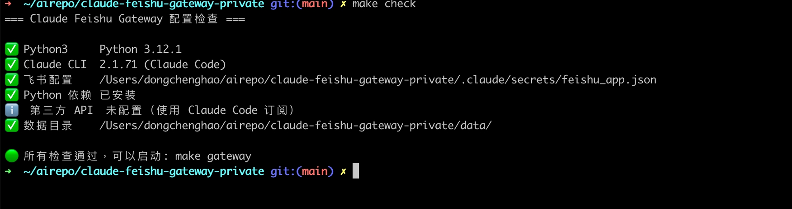
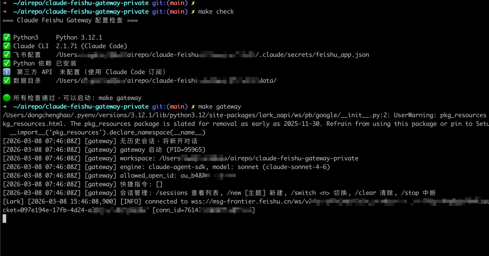
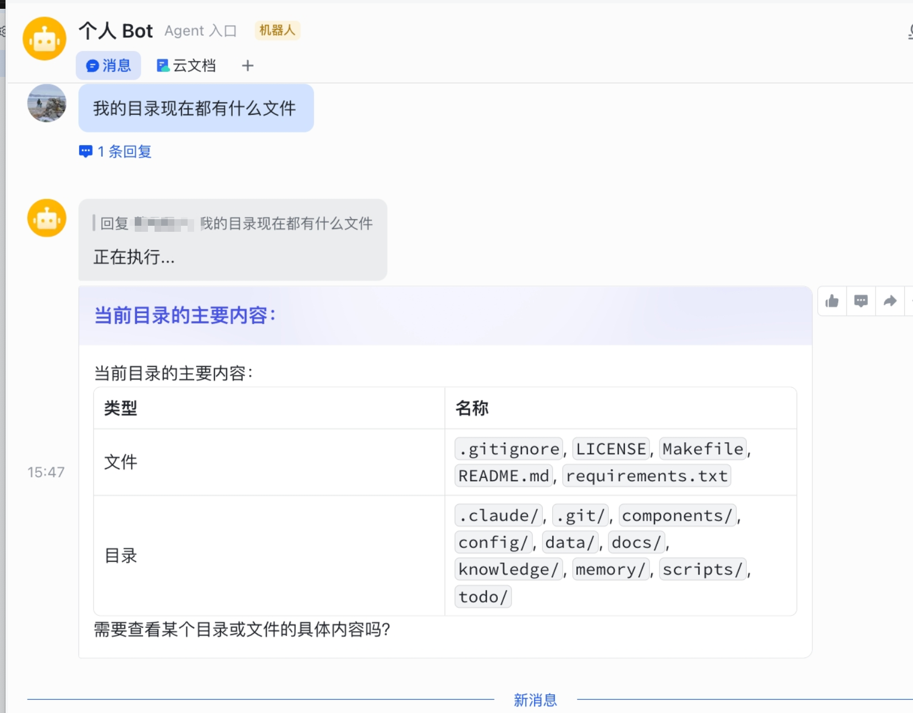

# macOS + Claude Code 订阅

最简配置，约 15 分钟完成

---

## 前置条件

- macOS 12+
- Python 3.10+ 和 Claude Code CLI 已安装并登录 → 没装过？看 **[环境准备指南](prerequisites-mac.md)**
- 飞书账号

验证 Claude Code 可用：

```bash
claude --version     # 应输出版本号
claude -p "说你好"   # 应返回一句话
```

---

## 第一步：创建飞书自建应用

详细图文教程见 [飞书 Bot 创建指南](feishu-bot-setup.md)

简要流程：创建应用 → 添加机器人能力 → 获取 App ID / Secret → 开通权限 → 发布 → 配置长连接回调 → 获取 Open ID

---

## 第二步：克隆仓库 & 配置

```bash
# 克隆
git clone https://github.com/ketchupz1999/claude-feishu-gateway.git
cd claude-feishu-gateway

# 安装依赖
pip3 install -r requirements.txt

# 配置飞书凭证
cp .claude/secrets/feishu_app.example.json .claude/secrets/feishu_app.json
# 编辑 feishu_app.json，填入 app_id、app_secret、allowed_open_id
```

`allowed_open_id` 是安全限制——只有这个飞书用户的消息才会被处理

---

## 第三步：检查 & 启动

```bash
make check      # 自动检查所有配置项
```



```bash
make gateway    # 启动飞书网关
```



---

## 第四步：测试

打开飞书手机端或桌面端，找到你的机器人，发送：

```
你好，介绍一下你自己
```

等几秒钟，应该收到 Claude 的回复



**快捷命令测试：**

| 命令          | 效果         |
| ------------- | ------------ |
| `/clear`    | 清除会话历史 |
| `/new 工作` | 新建命名会话 |
| `/sessions` | 查看所有会话 |
| `/stop`     | 中断当前执行 |

---

## 可选：启动 Daemon

Daemon 是后台调度器，用于定时执行 Skill（如知识库自检）。不启动也不影响聊天

```bash
make daemon     # 前台运行
make daemon-bg  # 或者后台运行
```

---

## 可选：后台运行 Gateway

日常使用建议后台运行：

```bash
make gateway-bg    # 后台启动
make gateway-logs  # 查看实时日志
make gateway-stop  # 停止
```

---

## 常见问题

### Gateway 启动后飞书没反应

1. 检查应用是否已发布（「版本管理与发布」中状态为「已上线」）
2. 检查是否开通了 `im:message` 权限
3. 检查事件订阅模式是否选了「长连接」
4. 看 Gateway 日志有没有错误

### 报错 `claude-code-sdk` 相关

确保 Claude Code 已安装并能正常使用：

```bash
claude -p "test"
```

如果这个命令不行，先解决 Claude Code 本身的问题

### 报错 `配置文件不存在`

检查 `.claude/secrets/feishu_app.json` 是否存在，格式是否正确（JSON 格式，三个字段都填了）
